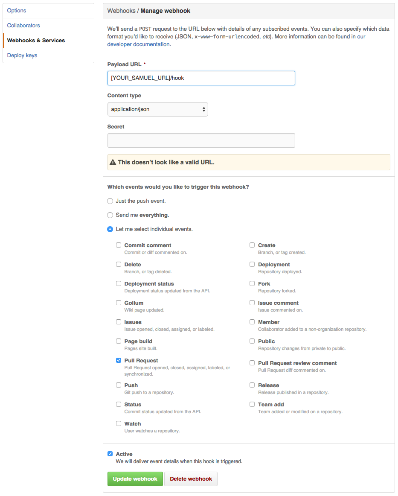

Samuel
======

[](https://travis-ci.org/reevoo/samuel)
[](http://inch-ci.org/github/reevoo/samuel)

Because some sucka's muckin' with our muckersuckin' code.


Samuel is here to make sure your pull requests are all they can be.

## Things He Can Do

* Post pull request guidelines to your pull request.
* Moan at you if you merge your pull request without code review.

## What He Will Do In The Future

* Moan at you if you leave your pull requests open for a long time.
* Moan at you if you commit directly to master.


## Install it

```sh
brew install elixir # Install Elixir
mix deps.get        # Download the dependencies
```


## Read the docs

```sh
mix docs            # Generate the docs
open doc/index.html # View the docs
mix inch            # See how the docs might be improved
```


## Run the tests

```sh
mix            # Run the tests and the dogma style checker
mix test       # Run tests once
mix test watch # Run tests on file changes
mix dogma      # Check for style violations
```


## Run the server (Development)

Run the REPL.

```sh
iex -S mix
```

You can run the server from the REPL like this:

```elixir
Samuel.API.Server.start
```

or, in one line:

```sh
elixir -S mix run -e "Samuel.API.Server.start"
```

Code is not automatically reloaded.

## Deploy it

Use this button:

[](https://heroku.com/deploy)

If it doesn't work, pull the repository and try this:

```sh
git remote add heroku [HEROKU_URL]
git push heroku master
```

## Use it

Go to your repo's settings
Click on the 'Webhooks & Services tab' and then 'Add webhook'.

Then configure it like this, replacing YOUR_SAMUEL_URL with the url of your samuel instance.



## LICENCE

```
Samuel - Angry Pull request bot
Copyright © 2015 Reevoo

Permission is hereby granted, free of charge, to any person obtaining
a copy of this software and associated documentation files (the "Software"),
to deal in the Software without restriction, including without limitation
the rights to use, copy, modify, merge, publish, distribute, sublicense,
and/or sell copies of the Software, and to permit persons to whom the
Software is furnished to do so, subject to the following conditions:

The above copyright notice and this permission notice shall be included
in all copies or substantial portions of the Software.

THE SOFTWARE IS PROVIDED "AS IS", WITHOUT WARRANTY OF ANY KIND,
EXPRESS OR IMPLIED, INCLUDING BUT NOT LIMITED TO THE WARRANTIES
OF MERCHANTABILITY, FITNESS FOR A PARTICULAR PURPOSE AND NONINFRINGEMENT.
IN NO EVENT SHALL THE AUTHORS OR COPYRIGHT HOLDERS BE LIABLE FOR ANY CLAIM,
DAMAGES OR OTHER LIABILITY, WHETHER IN AN ACTION OF CONTRACT,
TORT OR OTHERWISE, ARISING FROM, OUT OF OR IN CONNECTION WITH THE SOFTWARE
OR THE USE OR OTHER DEALINGS IN THE SOFTWARE.
```
